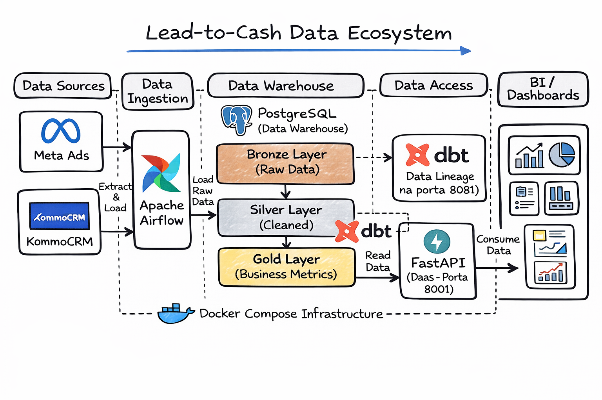
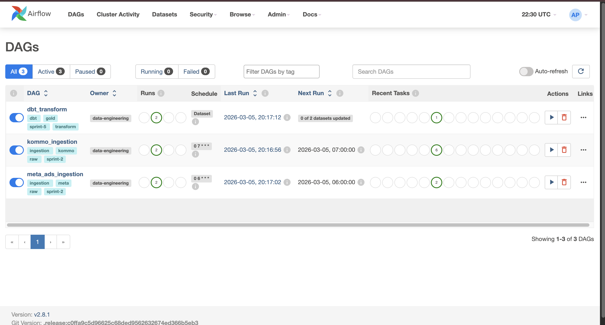
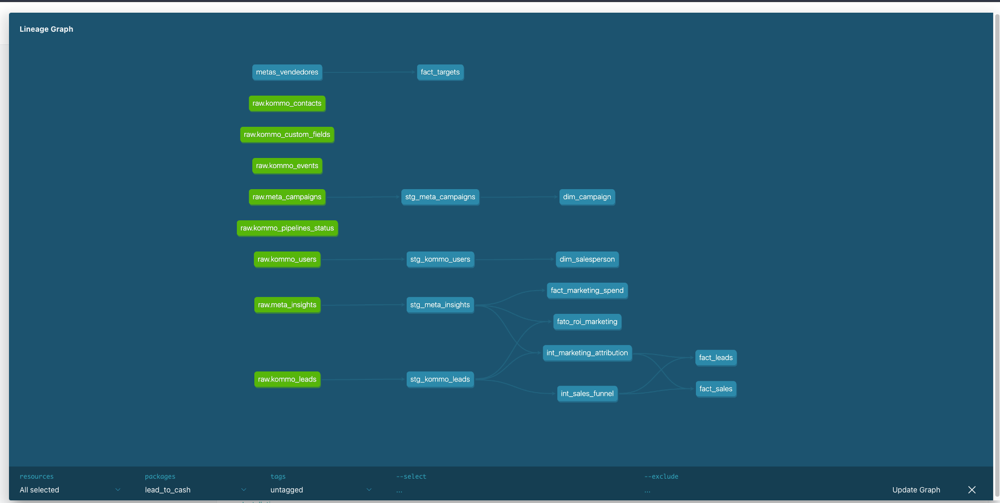
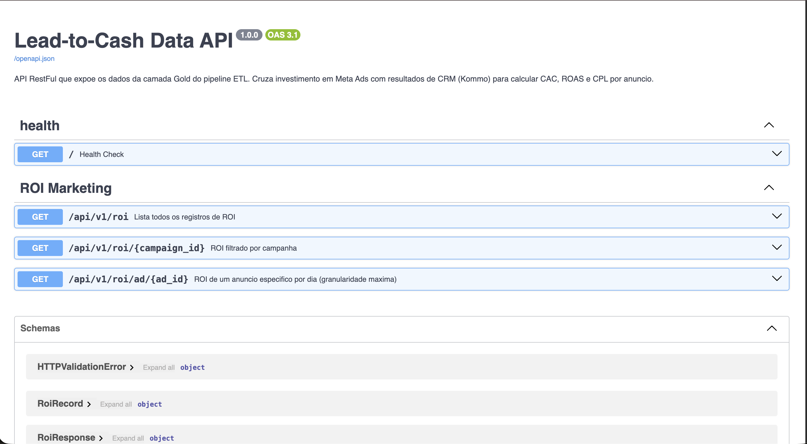

# Lead-to-Cash Data Pipeline: End-to-End Analytics Engineering

Este projeto reflete os desafios diários de uma equipe de dados: integrar sistemas isolados para entregar valor real ao negócio. O foco aqui é resolver um problema corporativo clássico: **cruzar dados de Marketing (Meta Ads) com Vendas (KommoCRM) para descobrir o verdadeiro ROI das campanhas.**

 

## O Contexto e o Problema de Negócio

No dia a dia das empresas, é muito comum que os dados vivam em silos. O marketing investe em anúncios no **Meta Ads**, e o time comercial gerencia os leads no **KommoCRM**. Como resultado, o marketing muitas vezes não sabe quais leads viraram clientes pagantes, e vendas não sabe a origem das conversões.

**A Abordagem:** Para resolver isso, estruturei um pipeline analítico padrão de mercado. O fluxo extrai esses dados, cruza as informações em um Data Warehouse e disponibiliza as métricas modeladas (como CAC e ROAS) prontas para o consumo das ferramentas de BI e áreas de negócio.

*Nota de Arquitetura: Para simular um ambiente corporativo sem expor dados sensíveis, desenvolvi Mock APIs em FastAPI que replicam fielmente a documentação do Meta Ads e do KommoCRM. O pipeline lida com a mesma complexidade estrutural, paginação e payload JSON que encontraríamos em produção. Todo o ambiente é executável localmente via Docker.*

---

## O Fluxo de Dados (Arquitetura)

A arquitetura foi desenhada seguindo as práticas comuns da *Modern Data Stack*:

1. **Data Sources:** **FastAPI** gerando dados simulados, mantendo os contratos e rate limits das APIs originais.
2. **Ingestão (Airflow):** Orquestração diária das extrações via **Apache Airflow**, lidando com paginação e carga incremental.
3. **Data Warehouse (PostgreSQL):** Recebimento dos dados brutos na camada **Bronze**.
4. **Transformação (dbt):** Modelagem de dados dentro do DW, passando pela limpeza (camada **Silver**) até o cruzamento das regras de negócio (camada **Gold**). O dbt também garante os testes de qualidade e a documentação.
5. **Disponibilização (DaaS):** Uma **API em FastAPI** consome a camada Gold para servir as métricas de forma estruturada, evitando consultas pesadas diretas no banco pelo BI.
6. **Infraestrutura:** Ambiente isolado e orquestrado com **Docker & Docker Compose**.

---

## Por Dentro do Pipeline

Aqui estão os bastidores da execução do projeto:

### 1. Orquestração (Apache Airflow)
Extração resiliente das APIs, controlando falhas e cargas diárias.

 

### 2. Modelagem e Linhagem (dbt Docs)
Rastreabilidade total do dado, da origem ao indicador de negócio, utilizando a arquitetura medalhão.



### 3. Disponibilização de Dados (FastAPI Swagger)
Endpoints prontos para consumo seguro por analistas e sistemas terceiros.



---

## Como Executar Localmente

O ambiente foi configurado para subir com facilidade na sua máquina.

### Pré-requisitos
* **Docker** e **Docker Compose** instalados.

### Passos para Inicialização

1. **Clone o repositório:**
   ```bash
   git clone [https://github.com/SEU_USUARIO/pipeline-etl.git](https://github.com/SEU_USUARIO/pipeline-etl.git)
   cd pipeline-etl
```

```

2. **Inicialize o ambiente Airflow:**
```bash
docker-compose up airflow-init

```

3. **Suba os containers:**
```bash
docker-compose up -d

```

---

## Mapa de Serviços Locais

Com os containers rodando, os serviços estarão disponíveis nas seguintes portas:

| Serviço | Papel no Ecossistema | URL Local | Credenciais |
| --- | --- | --- | --- |
| **Airflow UI** | Orquestração | [http://localhost:8080](https://www.google.com/search?q=http://localhost:8080) | `admin` / `admin` |
| **dbt Docs** | Catálogo e Linhagem | [http://localhost:8081](https://www.google.com/search?q=http://localhost:8081) | *Acesso Direto* |
| **Data API (DaaS)** | Consumo da Camada Gold | [http://localhost:8001/docs](https://www.google.com/search?q=http://localhost:8001/docs) | *Acesso Direto* |
| **Mock Sources API** | Origem dos Dados (Fake) | [http://localhost:8000/docs](https://www.google.com/search?q=http://localhost:8000/docs) | *Acesso Direto* |
| **PostgreSQL** | Data Warehouse (DW) | `localhost:5432` | `admin` / `admin` |

```
