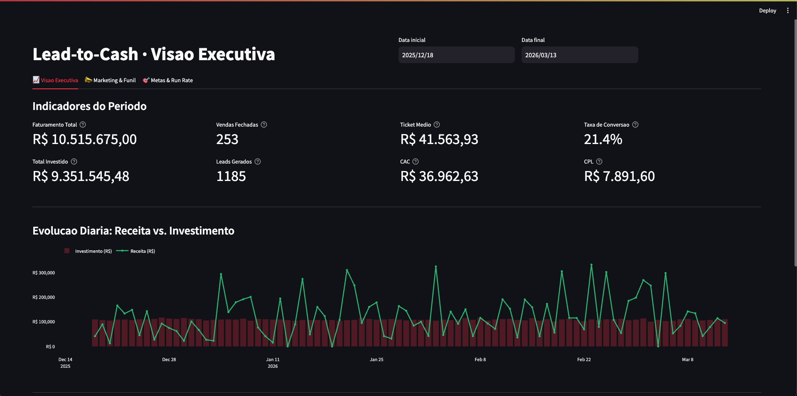

# Lead-to-Cash Data Pipeline: End-to-End Analytics Engineering

Este projeto reflete os desafios diários de uma equipe de dados: integrar sistemas isolados para entregar valor real ao negócio. O foco aqui é resolver um problema corporativo clássico: **cruzar dados de Marketing (Meta Ads) com Vendas (KommoCRM) para descobrir o verdadeiro ROI das campanhas.**


## O Contexto e o Problema de Negócio

No dia a dia das empresas, é muito comum que os dados vivam em silos. O marketing investe em anúncios no **Meta Ads**, e o time comercial gerencia os leads no **KommoCRM**. Como resultado, o marketing muitas vezes não sabe quais leads viraram clientes pagantes, e vendas não sabe a origem das conversões.

**A Abordagem:** Para resolver isso, estruturei um pipeline analítico padrão de mercado. O fluxo extrai esses dados, cruza as informações em um Data Warehouse e disponibiliza as métricas modeladas (como CAC e ROAS) prontas para o consumo de ferramentas de BI, dashboards e APIs externas.

*Nota de Arquitetura: Para simular um ambiente corporativo sem expor dados sensíveis, desenvolvi Mock APIs em FastAPI que replicam fielmente a documentação do Meta Ads e do KommoCRM. O pipeline lida com a mesma complexidade estrutural, paginação e payload JSON que encontraríamos em produção. Todo o ambiente é executável localmente via Docker.*

---

## O Fluxo de Dados (Arquitetura)

A arquitetura foi desenhada seguindo as práticas comuns da *Modern Data Stack*:

1. **Data Sources:** **FastAPI** gerando dados simulados, mantendo os contratos e rate limits das APIs originais.
2. **Ingestão (Airflow):** Orquestração diária das extrações via **Apache Airflow**, lidando com paginação e carga incremental. Uma DAG dedicada (`dbt_transform`) é disparada automaticamente via **Data-Aware Scheduling** assim que ambas as ingestões (Meta + Kommo) concluem.
3. **Data Warehouse (PostgreSQL):** Recebimento dos dados brutos na camada **Raw**.
4. **Transformação (dbt):** Modelagem em três camadas dentro do DW:
   - **Staging:** limpeza e padronização das fontes brutas (`stg_kommo_leads`, `stg_meta_insights`, etc.)
   - **Intermediate:** cruzamentos intermediários (`int_sales_funnel`, `int_marketing_attribution`)
   - **Marts:** tabelas de negócio finais (`fact_sales`, `fact_leads`, `dim_salesperson`, `fato_roi_marketing`, etc.)
   - **Seeds:** tabela de metas por vendedor (`metas_vendedores.csv`) carregada via `dbt seed`
5. **Disponibilização (DaaS):** Uma **API em FastAPI** consome a camada Marts para servir as métricas de forma estruturada e segura, protegida por autenticação via **API Key** (`X-API-Key` header).
6. **Dashboard Executivo (Streamlit):** Interface interativa consumindo a API interna, com KPIs, gráfico de evolução temporal, ranking de vendedores e filtros por período.
7. **Infraestrutura:** Ambiente isolado e orquestrado com **Docker & Docker Compose**.

---

## Por Dentro do Pipeline

Aqui estão os bastidores da execução do projeto:

### 1. Orquestração (Apache Airflow)
Extração resiliente das APIs, controlando falhas e cargas diárias. A DAG `dbt_transform` é disparada automaticamente por Data-Aware Scheduling após as DAGs de ingestão produzirem dados novos.


### 2. Modelagem e Linhagem (dbt Docs)
Rastreabilidade total do dado, da origem ao indicador de negócio, com 13 modelos organizados em Staging, Intermediate e Marts.


### 3. Disponibilização de Dados (FastAPI — DaaS Segura)
Endpoints prontos para consumo por analistas e sistemas terceiros, protegidos por API Key. As rotas internas do dashboard ficam ocultas do Swagger.


### 4. Dashboard Executivo (Streamlit)
Visão consolidada do funil Lead-to-Cash com KPIs de faturamento, CAC, taxa de conversão e ranking de vendedores com filtros interativos de período.


---

## Como Executar Localmente

O ambiente foi configurado para subir com facilidade na sua máquina.

### Pré-requisitos
* **Docker** e **Docker Compose** instalados.

### Passos para Inicialização

1. **Clone o repositório:**
   ```bash
   git clone https://github.com/papolonio/etl-sales-marketing-analytics.git
   cd pipeline-etl
   ```

2. **Configure as variáveis de ambiente:**
   ```bash
   cp .env.example .env
   # Edite .env se necessário (os valores padrão já funcionam localmente)
   ```

3. **Suba os containers:**
   ```bash
   docker compose up -d --build
   ```

4. **Carregue as seeds e rode os modelos dbt:**
   ```bash
   docker exec dbt-docs bash -c "cd /opt/airflow/dbt_analytics && dbt seed --profiles-dir . && dbt run --profiles-dir ."
   ```

5. **Acesse os serviços** (tabela abaixo).

---

## Mapa de Serviços Locais

Com os containers rodando, os serviços estarão disponíveis nas seguintes portas:

| Serviço | Papel no Ecossistema | URL Local | Credenciais |
| --- | --- | --- | --- |
| **Dashboard Streamlit** | Visão Executiva Lead-to-Cash | http://localhost:8501 | *Acesso Direto* |
| **Airflow UI** | Orquestração das DAGs | http://localhost:8080 | `admin` / `admin` |
| **dbt Docs** | Catálogo e Linhagem de Dados | http://localhost:8081 | *Acesso Direto* |
| **Data API — DaaS** | Consumo externo (requer API Key) | http://localhost:8001/docs | Header `X-API-Key` |
| **Mock Sources API** | Origem dos Dados Simulados | http://localhost:8000/docs | *Acesso Direto* |
| **PostgreSQL** | Data Warehouse | `localhost:5432` | `admin` / `admin` |

### Segurança da API DaaS

Os endpoints públicos (`/api/v1/public/*`) exigem autenticação via header HTTP:

```bash
curl -H "X-API-Key: l2c-secret-key-123" http://localhost:8001/api/v1/public/sales
```

Para produção, substitua o valor padrão pela variável de ambiente `CLIENT_API_KEY` no `.env`.
